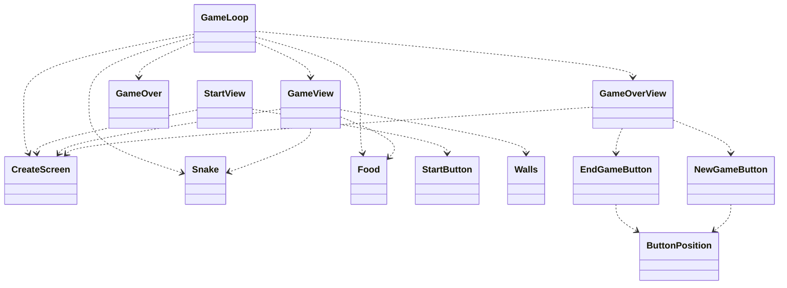
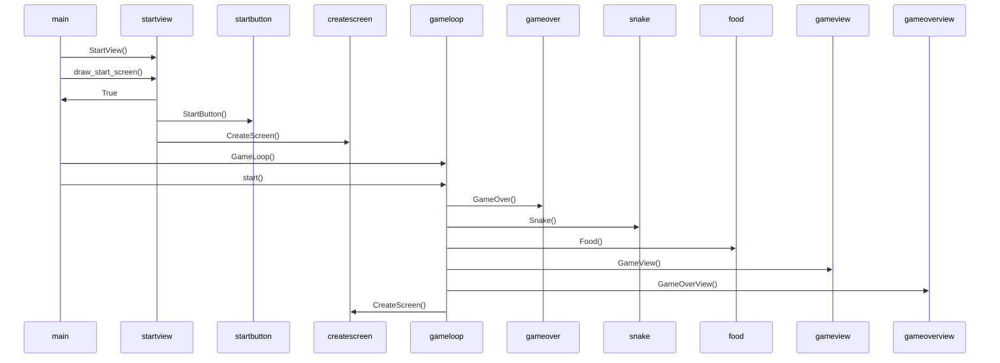

### Luokkakaavio

```mermaid
classDiagram
    GameLoop ..> GameView
    GameLoop ..> GameOverView
    GameLoop ..> CreateScreen
    GameLoop ..> Snake
    GameLoop ..> Food
    GameLoop ..> GameOver
    StartView ..> StartButton
    StartView ..> CreateScreen
    GameView ..> CreateScreen
    GameView ..> Walls
    GameView ..> Food
    GameView ..> Snake
    GameOverView ..> EndGameButton
    GameOverView ..> NewGameButton
    GameOverView ..> CreateScreen
    EndGameButton ..> ButtonPosition
    NewGameButton ..> ButtonPosition

```

### Sekvenssikaavio

```mermaid
sequenceDiagram
    participant main
    participant startview
    main ->> startview: StartView()
    main ->> startview: draw_start_screen()
    startview ->> main: True
    participant startbutton
    startview ->> startbutton: StartButton()
    participant createscreen
    startview ->> createscreen: CreateScreen()
    participant gameloop
    main ->> gameloop: GameLoop()
    main ->> gameloop: start()
    participant gameover
    gameloop ->> gameover: GameOver()
    participant snake
    gameloop ->> snake: Snake()
    participant food
    gameloop ->> food: Food()
    participant gameview
    gameloop ->> gameview: GameView()
    participant gameoverview
    gameloop ->> gameoverview: GameOverView()
    participant createscreen
    gameloop ->> createscreen: CreateScreen()


```