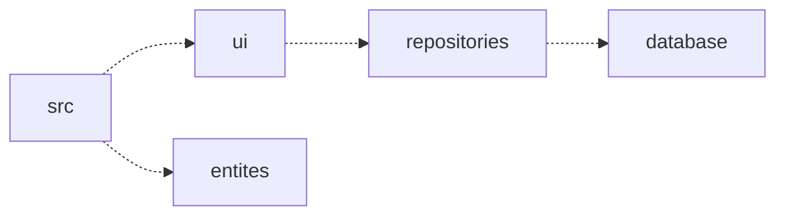
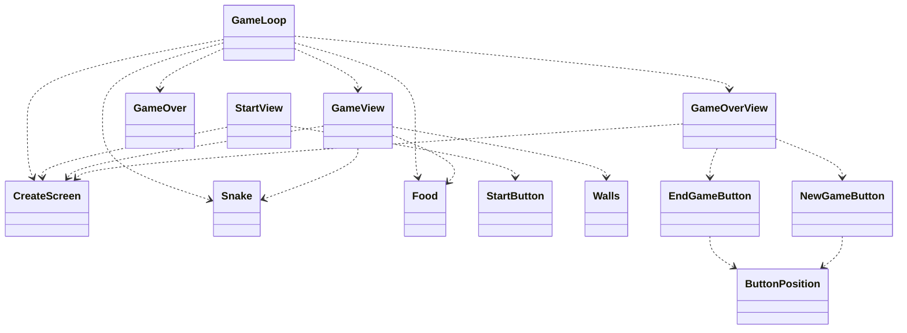
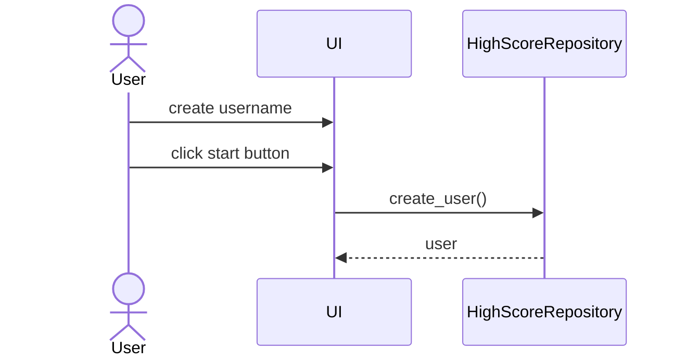
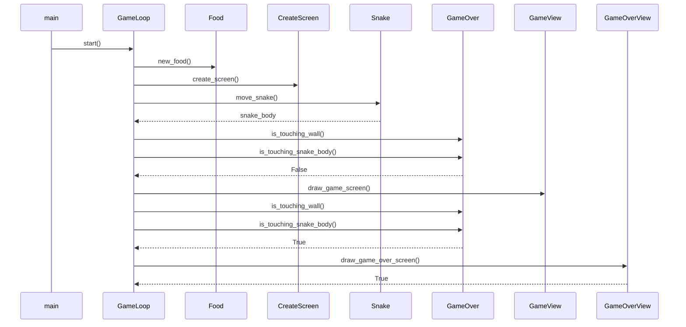

# Arkkitehtuuri

## Rakenne

### Pakkausrakenne

## Käyttöliittymä

Käyttöliitymä sisältää kolme eri näkymää:

- Pelin aloitusnäkymä
- Itse pelinäkymä
- Pelin lopetusnäkymä

### Luokkakaavio

## Sekvenssikaaviot

### Pelin aloitus

### Pelin kulku

