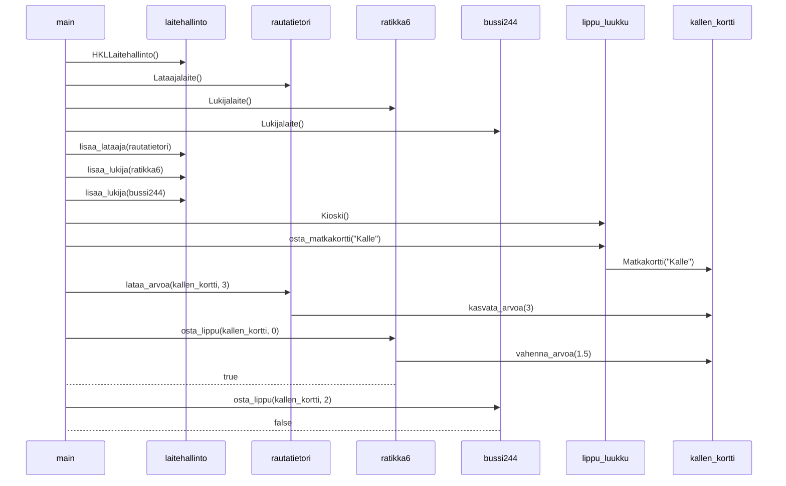

```mermaid
sequenceDiagram
	participant main
	participant laitehallinto
	main ->> laitehallinto: HKLLaitehallinto()
	participant rautatietori
	main ->> rautatietori: Lataajalaite()
	participant ratikka6
	main ->> ratikka6: Lukijalaite()
	participant bussi244
	main ->> bussi244: Lukijalaite()
	main ->> laitehallinto: lisaa_lataaja(rautatietori)
	main ->> laitehallinto: lisaa_lukija(ratikka6)
	main ->> laitehallinto: lisaa_lukija(bussi244)
	participant lippu_luukku
	main ->> lippu_luukku: Kioski()
	main ->> lippu_luukku: osta_matkakortti("Kalle")
	participant kallen_kortti 
	lippu_luukku ->> kallen_kortti: Matkakortti("Kalle")
	main ->> rautatietori: lataa_arvoa(kallen_kortti, 3)
	rautatietori ->> kallen_kortti: kasvata_arvoa(3)
	main ->> ratikka6: osta_lippu(kallen_kortti, 0)
	ratikka6 ->> kallen_kortti: vahenna_arvoa(1.5)
	ratikka6 --> main: true
	main ->> bussi244: osta_lippu(kallen_kortti, 2)
	bussi244 --> main: false
```
