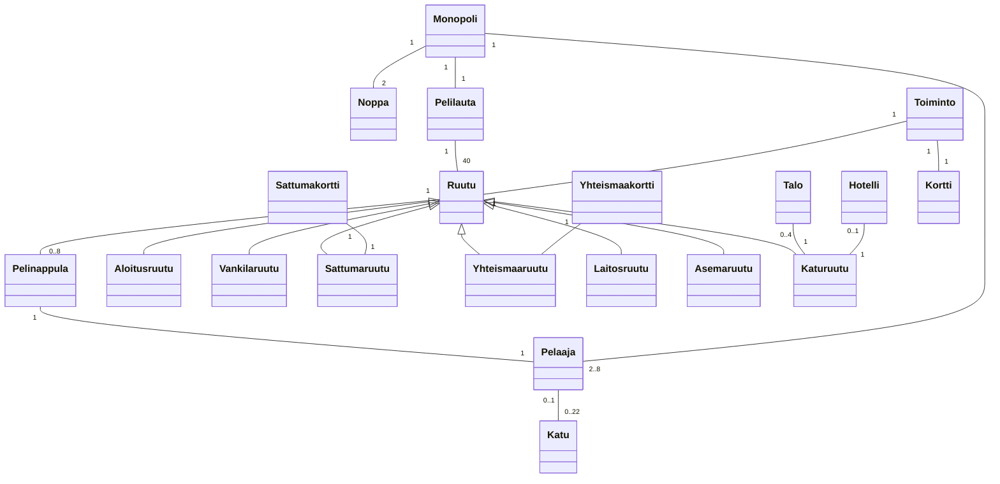

```mermaid
classDiagram
        Monopoli "1" -- "2" Noppa
        Monopoli "1" -- "1" Pelilauta
        Pelilauta "1" -- "40" Ruutu
        Ruutu "1" -- "0..8" Pelinappula
        Pelinappula "1" -- "1" Pelaaja
        Pelaaja "2..8" -- "1" Monopoli
	Pelaaja "0..1" -- "0..22" Katu
	Ruutu <|-- Aloitusruutu
	Ruutu <|-- Vankilaruutu
	Ruutu <|-- Sattumaruutu
	Ruutu <|-- Yhteismaaruutu
	Ruutu <|-- Laitosruutu
	Ruutu <|-- Asemaruutu
	Ruutu <|-- Katuruutu
	Talo "0..4" -- "1" Katuruutu
	Hotelli "0..1" -- "1" Katuruutu
	Toiminto "1" -- "1" Ruutu
	Sattumakortti "1" -- "1" Sattumaruutu
	Yhteismaakortti "1" -- "1" Yhteismaaruutu
	Toiminto "1" -- "1" Kortti
```
