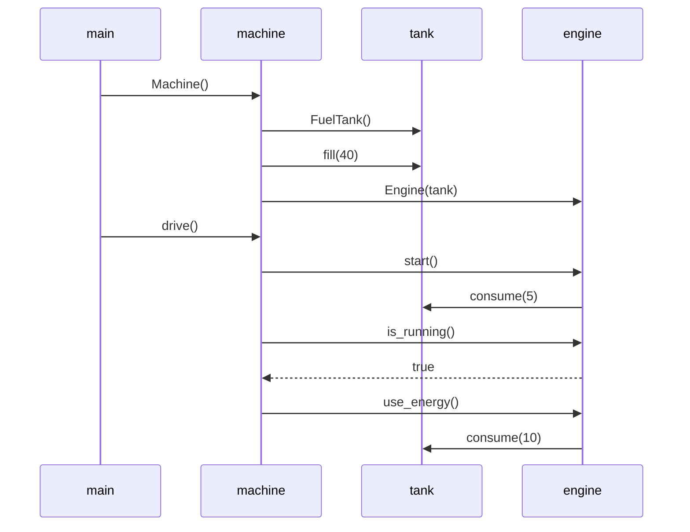

```mermaid
sequenceDiagram
	participant main
	participant machine
	main ->> machine: Machine()
	participant tank
	machine ->> tank: FuelTank()
	machine ->> tank: fill(40)
	participant engine
	machine ->> engine: Engine(tank)
	main ->> machine: drive()
	machine ->> engine: start()
	engine ->> tank: consume(5)
	machine ->> engine: is_running()
	engine -->> machine: true
	machine ->> engine: use_energy()
	engine ->> tank: consume(10)
```